# Car Price Prediction using Linear Regression

## Project Overview
This project predicts car prices using Machine Learning.

The project includes:
- Data Cleaning
- Exploratory Data Analysis (EDA)
- Pearson Correlation Test
- Chi-Square Test
- Feature Engineering
- Linear Regression Model
- Model Evaluation using R2 and Adjusted R2

---

## Dataset Features
Some important features used:
- engine size
- horsepowercar width
- car length
- wheelbase
- fuel system
- drive wheel
- cylinder number

Target Variable:
- price

---

## Technologies Used
- Python
- Pandas
- NumPy
- Matplotlib
- Seaborn
- Scikit-learn
- SciPy

---

## Steps Performed

### 1. Data Cleaning
- Removed missing values
- Handled categorical data
- Encoding applied

### 2. Exploratory Data Analysis
- Histograms
- Correlation analysis
- Feature distribution

#### EDA Graphs

##### Target Variable Distribution
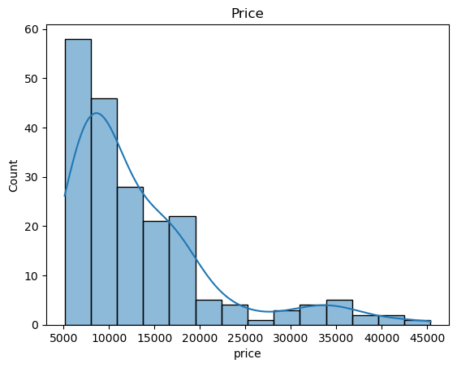

##### Numerical Feature Distribution 
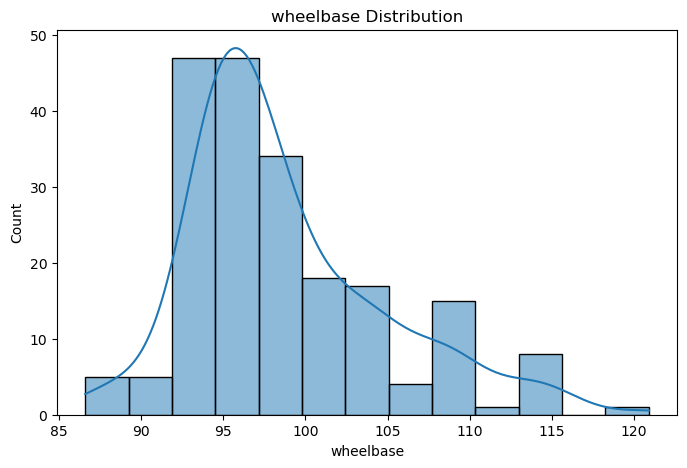
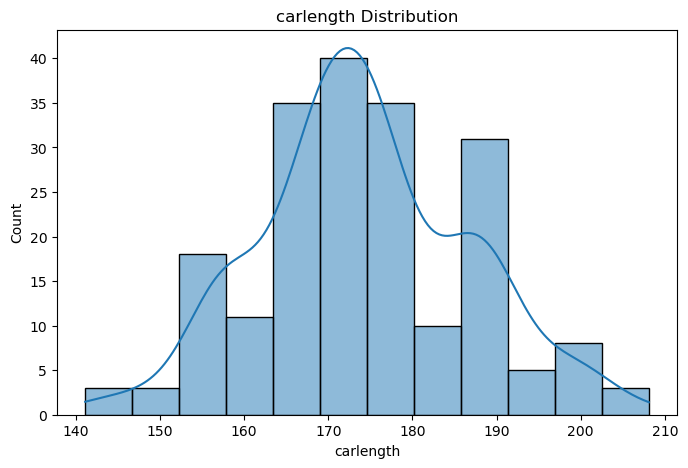
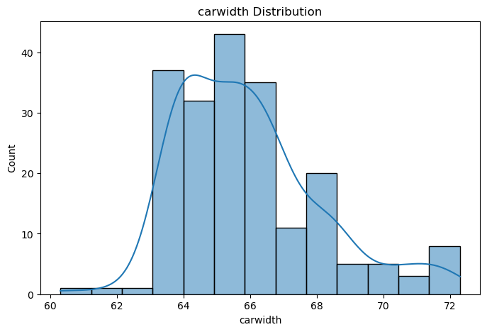
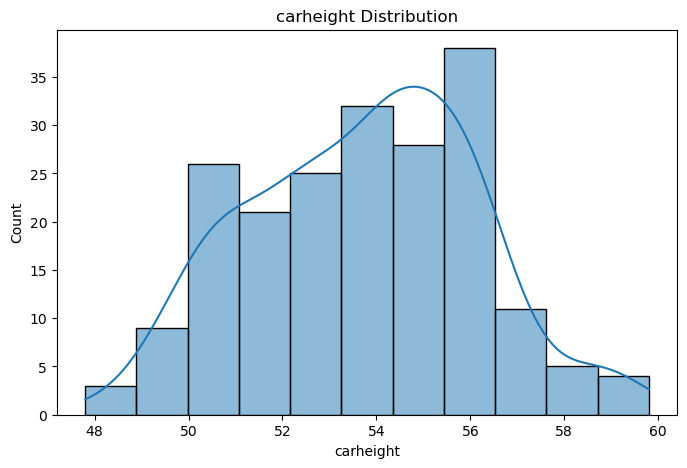
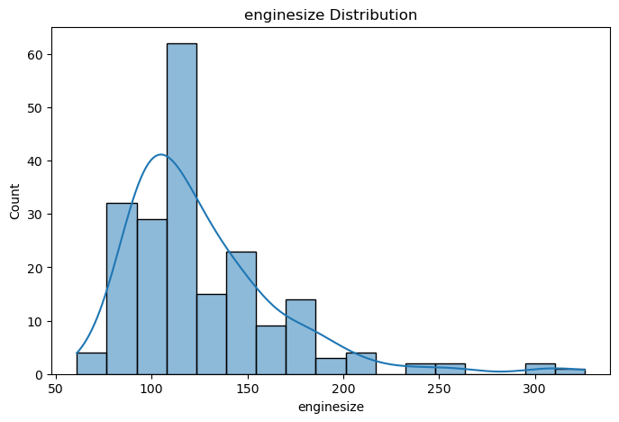
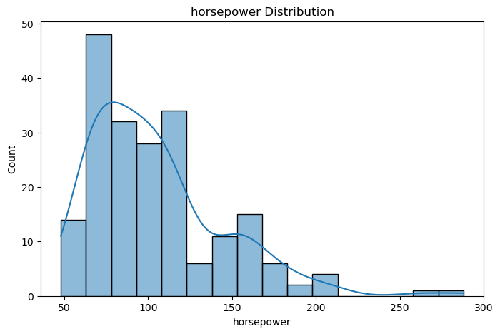
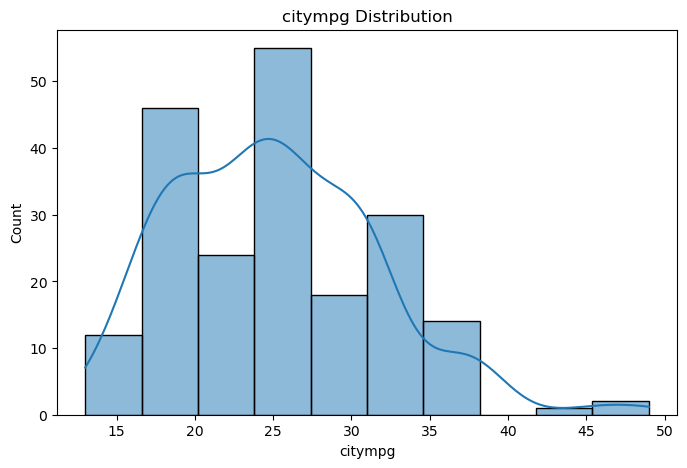
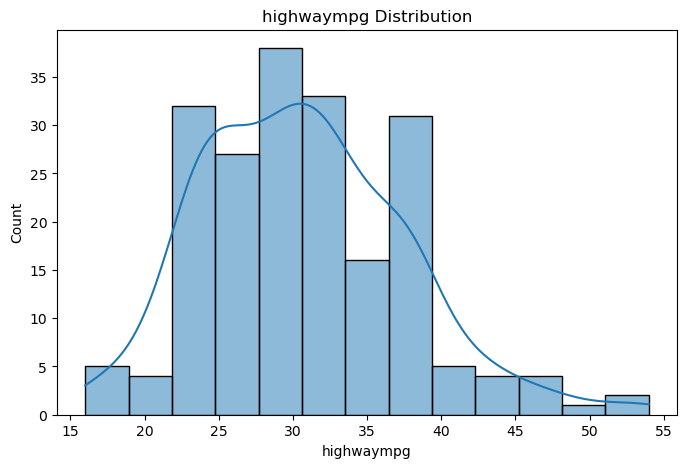

##### Categorical Feature Distribution
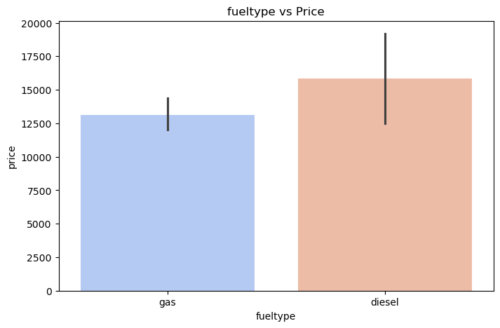
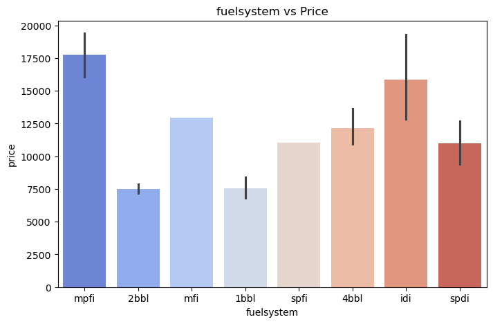
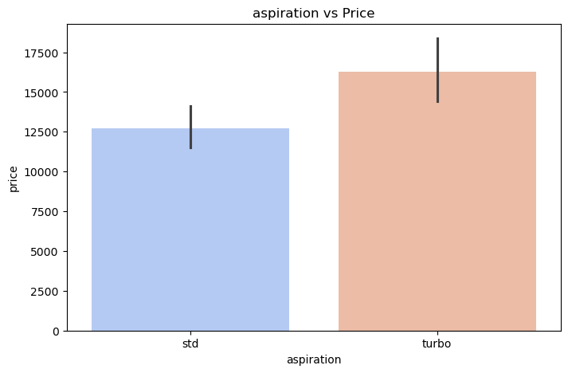
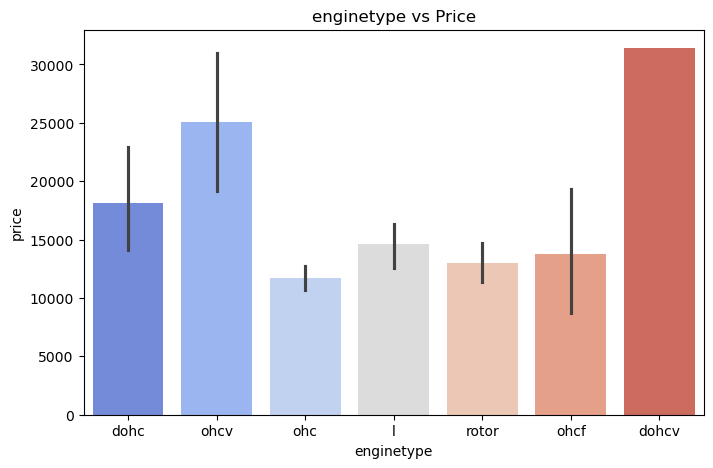
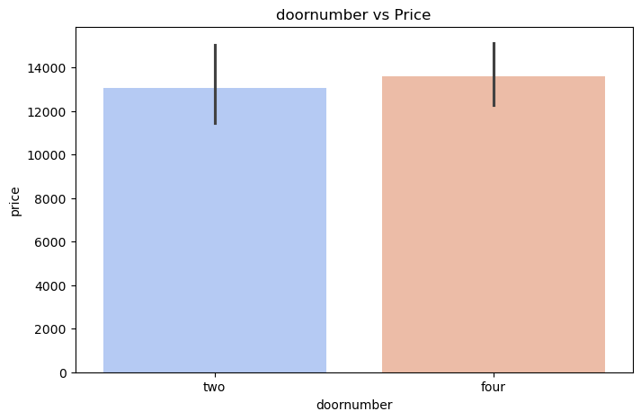
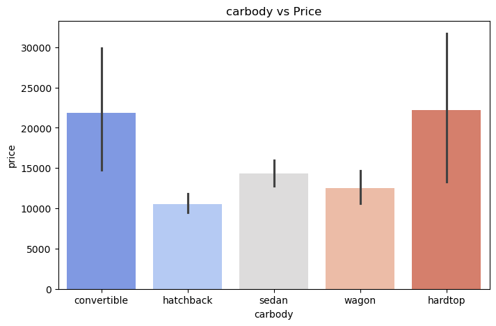
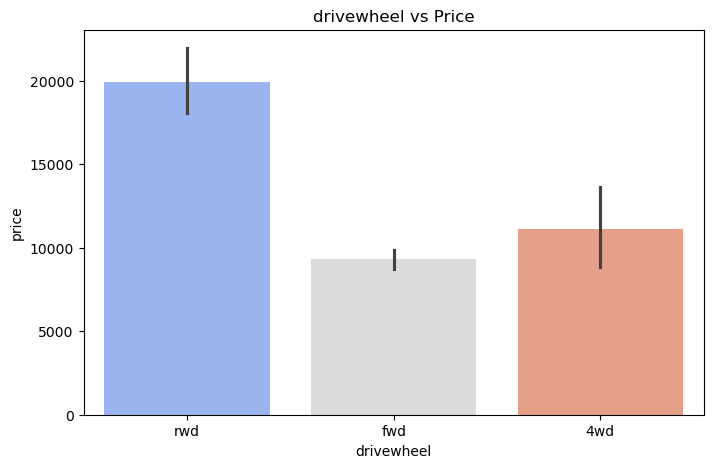
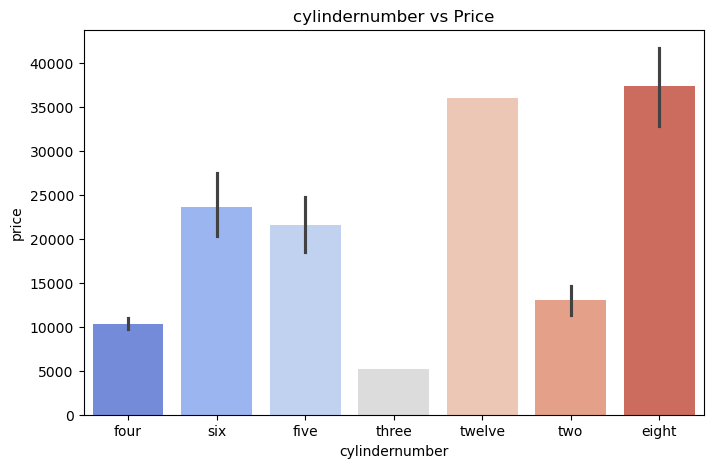

##### Correlation Heatmap
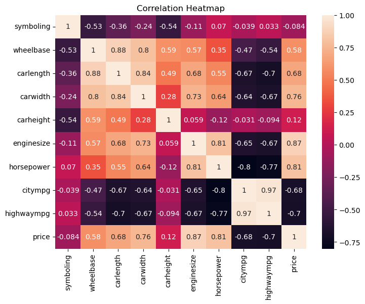

### 3. Pearson Correlation Test
Used for numerical features to identify highly correlated variables.

### 4. Chi-Square Test
Used for categorical feature selection.

### 5. Model Building
Implemented Linear Regression using Scikit-learn.

### 6. Model Evaluation

#### First Model
- R2 Score: 82.662 %
- Adjusted R2: 50.463 %

#### Secomd Model
- R2: 80.665 %
- Adjusted R2: 75.501 %

Second model performed better because adjusted R2 improved significantly and overfitting reduced.

---

## Conclusion
Linear regression successfully predicted car prices with good accuracy after proper feature selection and preprocessing.

---

## Author 
Mansi Nakum
